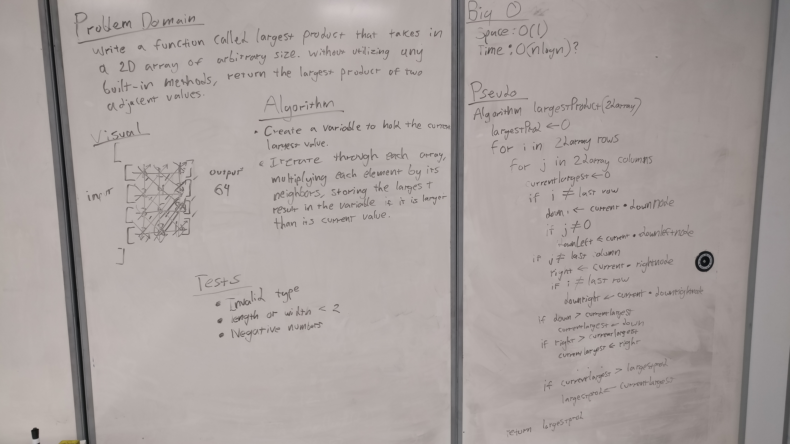

# Adjacent Product

The idea behind this challenge is finding the largest adjacent product in a two-dimensional array 

## Challenge:

Write a function called LargestProduct which takes in a 2D array, of arbitrary size.  
Without utilizing any of the built-in methods available to your language, return the largest product of 2 adjacent values within the 2D array.  
Adjacent values might be horizontally, vertically, or diagonally connected.

## Solution:

Here is an image of the whiteboard activity that was done for this challenge.

## Explanation:

We solved the challenge in a brute force method because it was the only way that we could think of (with an hour of whiteboarding) to solve this problem.
Phil taunted us by saying there was a more efficient method to do this but wouldn't tell us (though I wouldn't want him to anyways)