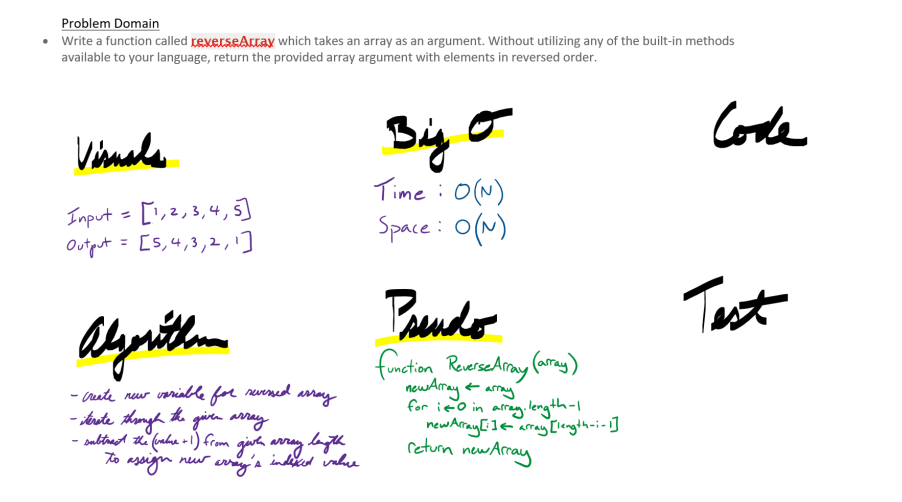

# Reverse an Array

The idea behind this challenge is to reverse an array without using built-in methods. This is to let people understand the code behind the built-in methods that they might take for granted.

## Challenge:

Write a function called reverseArray which takes an array as an argument. Without utilizing any of the built-in methods available to your language, return the provided array argument with elements in reversed order.

## Solution:

Here is an image of the whiteboard activity that was done for this challenge. This one is a screenshot from a tablet but in the future it will be a picture on a whiteboard.

## Explanation:

We solved the challenge in this way because it was the easiest method to solve this challenge that we could think of.