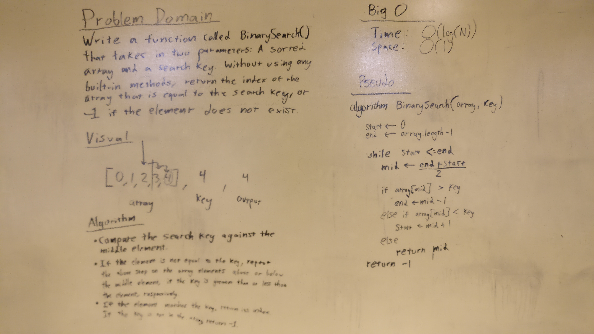

# Binary Search

The idea behind this challenge is to find a specific value in a sorted array. This is to let people understand the code behind the built-in methods that they might take for granted.

# Challenge:

Write a function called BinarySearch which takes in 2 parameters: a sorted array and the search key. Without utilizing any of the built-in methods available to your language, return the index of the array’s element that is equal to the search key, or -1 if the element does not exist.

# Solution:

Here is an image of the whiteboard activity that was done for this challenge.

# Explanation:

We solved the challenge in a recursive method because it is the most time efficient method (with regards to the Big O) to solve this problem.