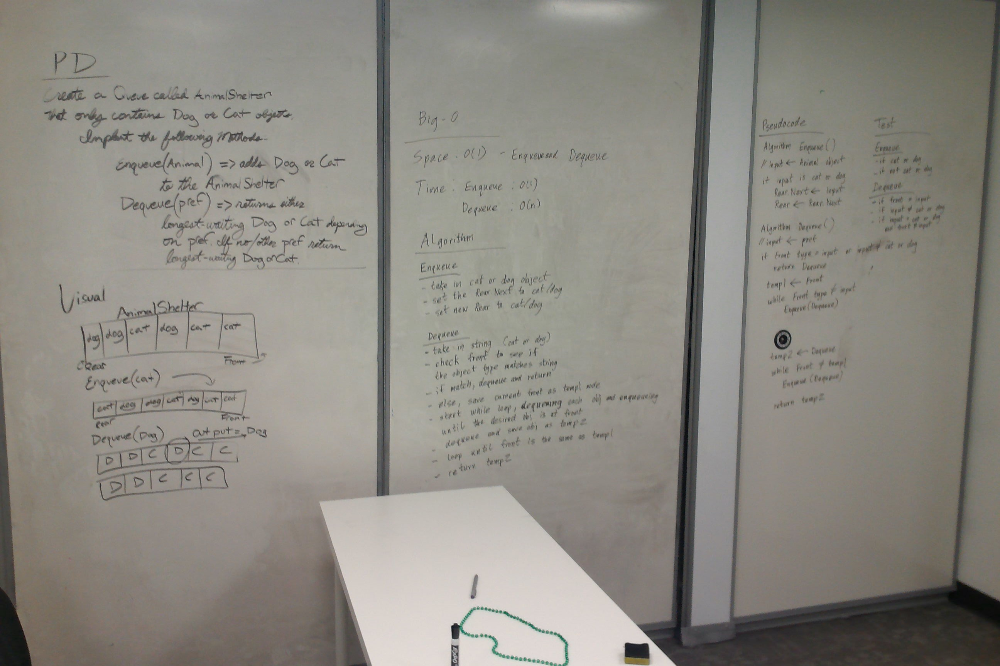

# First-In, First out Animal Shelter
This simulates a queue using Animal objects instead of Nodes (and taking in string values instead of int).  
The shelter only accepts "dog" objects or "cat" objects.  
People who want to adopt a dog or cat can specify which one and they receive the dog or cat (as specified) that has been in the shelter the longest.  
If the person did not specify or specified something that is not in the shelter, they receive the animal that has been in the shelter the longest.  

## Challenge
Create a class called AnimalShelter which holds only dogs and cats. 
The shelter operates using a first-in, first-out approach.
Implement the following methods:  
	- Enqueue(animal): adds animal to the shelter. The animal can be either a dog or a cat object.
	- Dequeue(pref): Returns either a dog or a cat.
					 If pref, a string, is ‘cat’ return the longest-waiting cat. 
					 If pref is ‘dog’, return the longest-waiting dog. 
					 For anything else, return either a cat or a dog.

## Solution
Here is how my group whiteboarded the solution:  
  

## Explanation
I ran into an issue where I accidentally enqueued the same dog twice which caused an infinite loop.  
Once I tested the .Print() method for the Animal Shelter I found out the problem and was able to fix the issue.