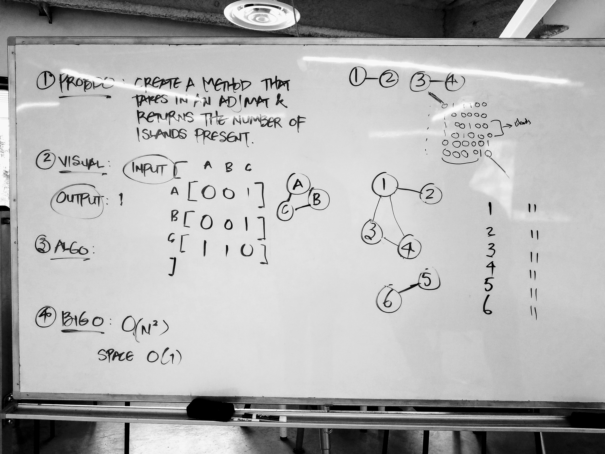

# Find Islands
A graph can be assumed through an adjacency matrix.  
An island is when the graph has nodes which are disconnected from other nodes.  
This method takes in an adjacency matrix and returns how many islands there are in the graph.  

## Challenge
Create a function that brings an an adjacency matrix and determines whether or not there are any islands.  
Without utilizing any of the built-in methods available to your language, 
return the number of islands present in the graph data structure.

## Solution
Here is a whiteboard of the problem:  

While whiteboarding, I could not figure out how to implement a solution to the problem.  

## Explanation
Within the hour of whiteboarding I could not figure out how to start implementing a solution;  
I understood conceptually what had to be done but I couldn't figure out how to do it with code.  
I had help from Eric Singleton in order to understand how I could find the number of islands.  