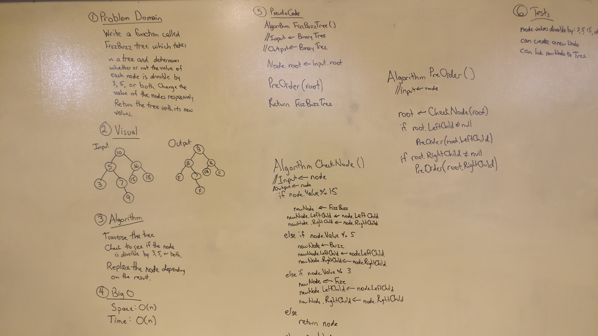

# FizzBuzz Tree
FizzBuzz takes in a value and sees if it is divisible by 3, 5, or both.  
If the value is divisible by 3, it returns "Fizz".  
If the value is divisible by 5, it returns "Buzz".  
If the value is divisible by both 3 and 5, it returns "FizzBuzz".  
If the value is not divisible by 3 or 5, it returns the value itself.  
The idea behind FizzBuzz Tree is that we would traverse the entire tree 
and change the values in the tree based off of FizzBuzz.  

## Challenge
Write a function called FizzBuzzTree which takes a tree as an argument.  
Without utilizing any of the built-in methods available to your language, 
determine weather or not the value of each node is divisible by 3, 5 or both, 
and change the value of each of the nodes respectively. 
Return the tree with it’s news values.

## Solution
  

## Explanation
The majority of the pseudocode was followed but I didn't like the idea of changing the PreOrder Method 
so I rewrote it as the FizzBuzzTree method.  
There was less involved with the CheckNode method since we learned in class 
that it would be easier to change the node so that the values it takes in are strings 
rather than making a new node that uses strings for values and then inserting it into the tree.  