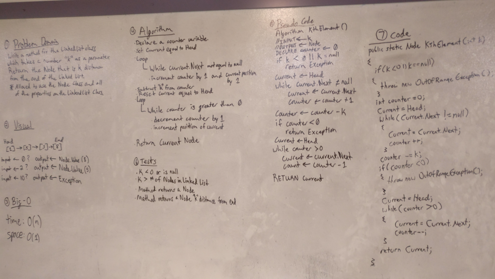

# Kth from the end of a Linked List
This takes in a value "k" and then returns the node "k" nodes away from the end of a linked list.

## Challenge
Write a method for the Linked List class which takes a number, k, as a parameter.  
Return the node that is k from the end of the linked list.  
You have access to the Node class and all the properties on the Linked List class as well as the methods created in previous challenges. ​ 

## Solution
  

## Explanation
Though the whiteboard was different; we went over an optimized solution in class so I implemented it.
