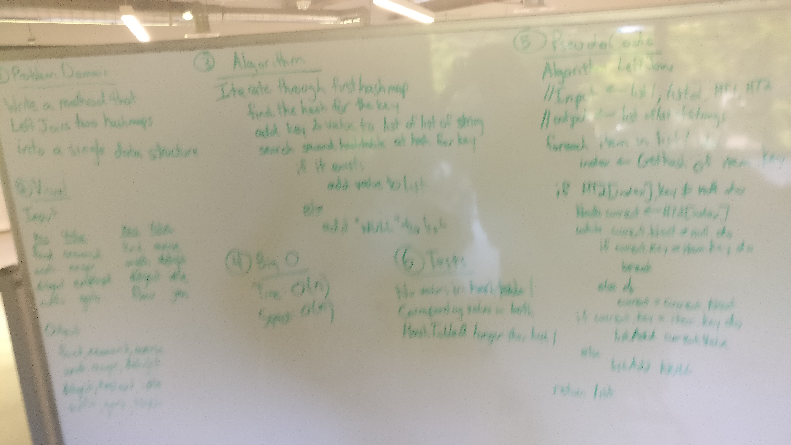

# Left Join
This challenge uses two hash tables to implement a simple Left Join logic.  
I assume that the only inputs are the two hash tables with no knowledge of what the key/value pairs are.  

## Challenge
Write a function that LEFT JOINs two hashmaps into a single data structure.  
The first parameter is a hashmap that has word strings as keys, and a synonym of the key as values.  
The second parameter is a hashmap that has word strings as keys, and antonyms of the key as values.  
Combine the key and corresponding values (if they exist) into a new data structure according to LEFT JOIN logic.  

## Solution
  

## Explanation
I am assuming that the first hash table has no conflicts as I grab the key; 
I know it is possible to account for it but at the time of implementation I did not consider it.