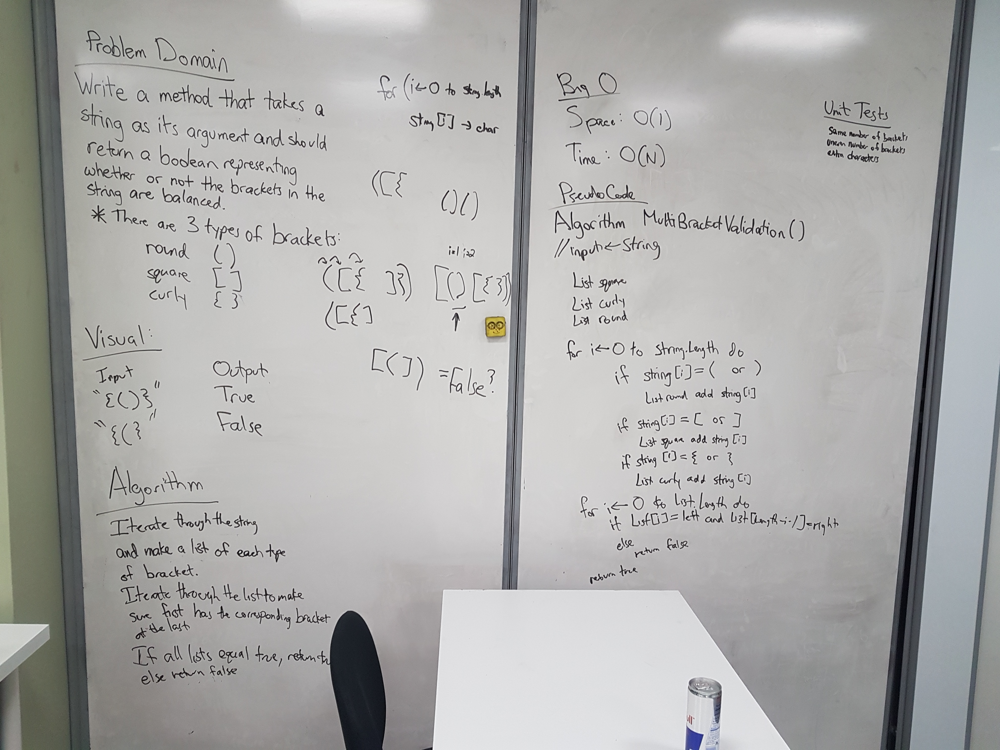

# Multi-bracket Validation
This method takes in a string, and returns a true or false value
depending on if the brackets in the string follow a valid bracket format.  
If the string does not have any brackets, it would return true 
because without using brackets an invalid format can't be used.  

## Challenge
Create a function that takes in a string as an argument 
and it will return a boolean representing whether or not the brackets are valid.  
There are 3 types of brackets:  
	* Round Brackets: ()
	* Square Brackets: []
	* Curly Brackets: {}

## Solution
Here is a whiteboard of a way to solve this challenge:  
  

## Explanation
While discussing how to solve this problem, we came upon using counters.  
I really liked that idea and had a better idea of how to implement it so I used that instead of Lists.  