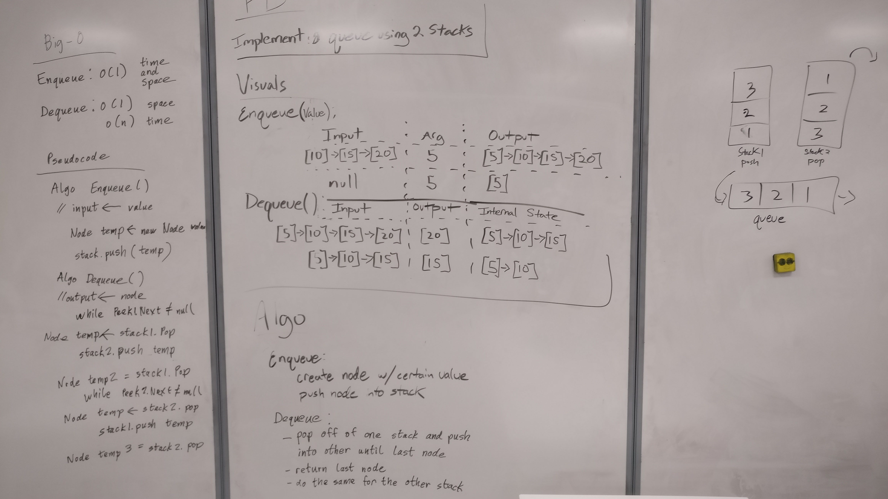

# Implement a Queue using two Stacks
We recently learned about stacks and queues;  
Stacks follow the idea of First In Last Out (FILO) or Last In First Out (LIFO).  
On the other hand, Queues follow the idea of First In First Out (FIFO).  
The idea for this challenge is to use two stacks to copy a queue format (FIFO).  

## Challenge
Implement the following methods for the Queue class:  

	Enqueue(value) which inserts value into the Queue using a first-in, first-out approach.
	Dequeue() which extracts a value from the Queue using a first-in, first-out approach.
You have access to 2 Stack instances with push and pop methods.

## Solution

## Explanation
While writing this whiteboard we weren't sure about what the problem was asking so in the end our pseudocode was somewhat rushed.  
Still, the basics of the pseudocode was correct and was implemented in my actual code.  
