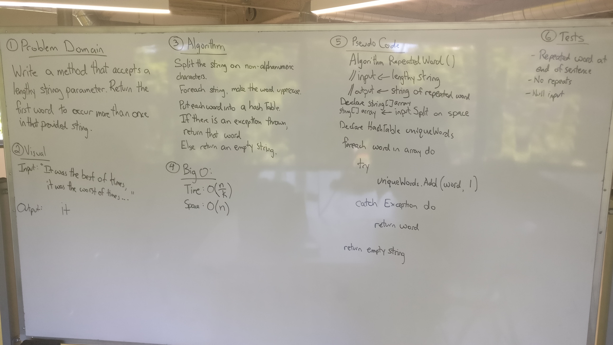

# Repeated Word
This is useful for determining things like unique usernames and changing passwords to one which you haven't used.  
The best data structure to solve this challenge is with a Hashtable or Hashset (a subset of Hashtable).  
The challenge is written below:  

## Challenge
Write a function that accepts a lengthy string parameter.  
Without utilizing any of the built-in library methods available to your language, 
return the first word to occur more than once in that provided string.

## Solution
  

## Explanation
I currently remove periods and commas just to show some basic symbols that I would want to ignore.  
I could have written them all out or used RegEx to filter them but I am just showing the basic concept of finding duplicate words.  