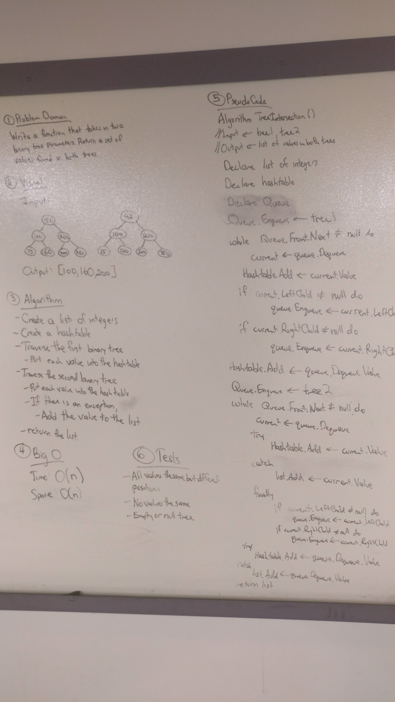

# Tree Intersection
This looks at two trees and returns the values that are the same. It is useful for comparing data.  
While this challenge does not account Binary Search Trees, it would still find the similar values but in a less efficient manner.  

## Challenge
Write a function called TreeIntersection that takes two binary tree parameters.  
Without utilizing any of the built-in library methods available to your language, 
return a set of values found in both trees.

## Solution
  

## Explanation
I realize that the code I wrote could be more efficient but I wasn't able to come up with how to write it.  