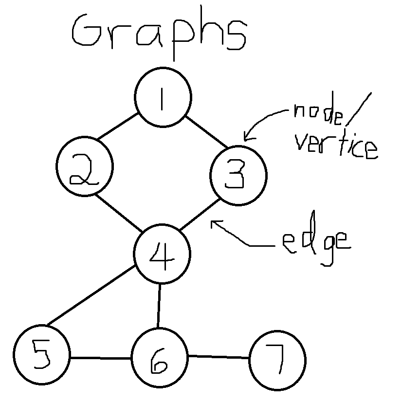

# Graph

## Data Structure
This data structure is a graph; it is a collection of nodes and are grouped together.  
A tree is a type of graph; an acyclic connected graph.  
Each node has a list of references which is noted as children (but is probably better to be called neighbors).  
A node can also be called a vertice while the connection between two nodes is called an edge.  

## Visual:
Here is how a graph might look like:  

## Implementation
I utilized nodes in order to implement graphs.  
Other than the value, each node has a list of references to any nodes connected to it.  
Finally, for the breadth-first traversal there is a boolean for each node to mark whether or not it has been visited.  
I implemented a graph through classes and setting up methods for it.  
To implement this version of a graph, a few steps must be followed:  
1. Download Visual Studio  
2. Clone the GitHub repository "Data-Structures-And-Algorithms"  
3. Inside the folder "Graph" open the sln file "Graph" in Visual Studio  
4. You may now utilize the graph class by using Graph.Classes as a library
and then using the Graph class created in this solution.

## Example Uses
Graph:  
A graph can be used for maps where the edge is weighted with the distance or time between vertices.  
It can also be used for social networks to connect people who know each other. 
This can be used to give a suggestion for other people who you might know to add to your network.

## Resources used:
https://codefellows.github.io/code-401-dotnet-guide/Curriculum/Class26/Resources/Graphs