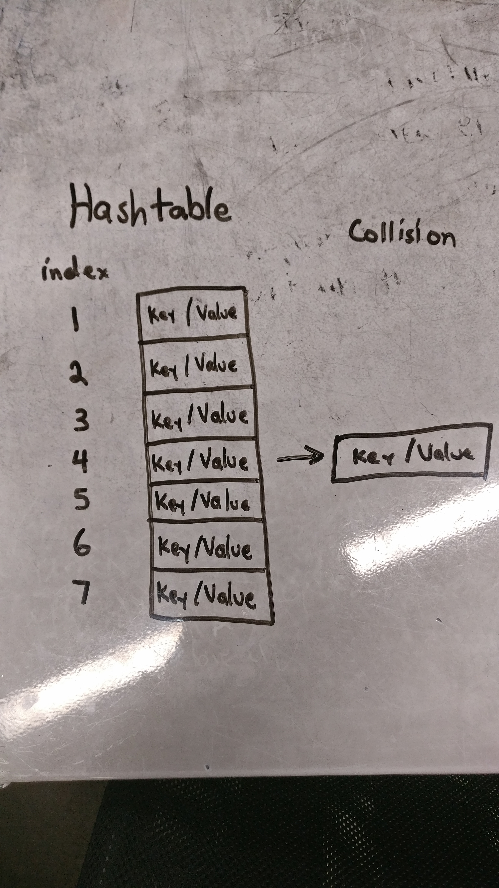

# HashTables

## Data Structure
This data structure is an array of key/value pairs. This has been implememnted through an array of nodes.  
To determine the index of where to put a pair, a "hash" is done with a series of calculations.  
This is done in hope that the index would be unique and will not intersect with another key.  
If there is an intersection (collision) then we store the older key/value pair into a bucket related to that specific index.  

## Visual
  

## Implementation
I implemented this data structure through an array of nodes.  
Each node has a "Value", "Key", and "Next" property.  
The "Key" and "Value" property store the key/value pair respectively.  
The "Next" property is for if there is a collision. 
If there is a collision, we set the new node's "Next" value to be the previous node.  

## Examples
I would use this if I ever have to find the number of unique characters or words in a sentence.  
Another use would be for implementing a chess program.