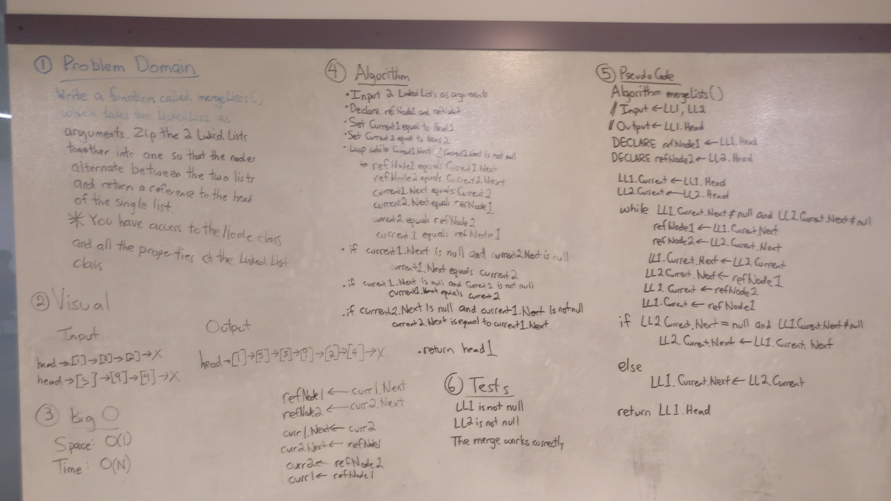
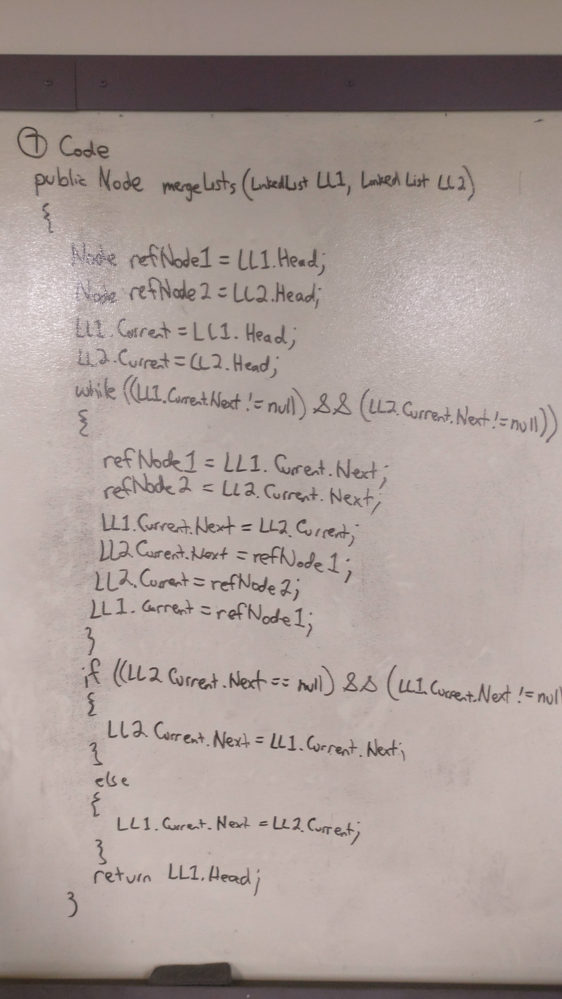

# Merge two Linked Lists
This method takes two linked lists and merges them into the first linked list.  
This essentially makes the second linked list irrelevant since the first linked list would have all of the same nodes as the second but with an additional node.

## Challenge
Write a function called mergeLists which takes two linked lists as arguments.  
Zip the two linked lists together into one so that the nodes alternate between the two lists and return a reference to the head of the single list.   
Try and keep additional space down to O(1).   
You have access to the Node class and all the properties on the Linked List class as well as the methods created in previous challenges.  

## Solution
  
  

## Explanation
The majority of our code was correct but at the end of our while loop we forgot to connect the last few nodes inside our if statement.  