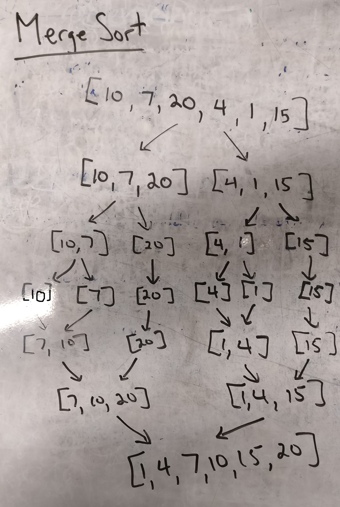
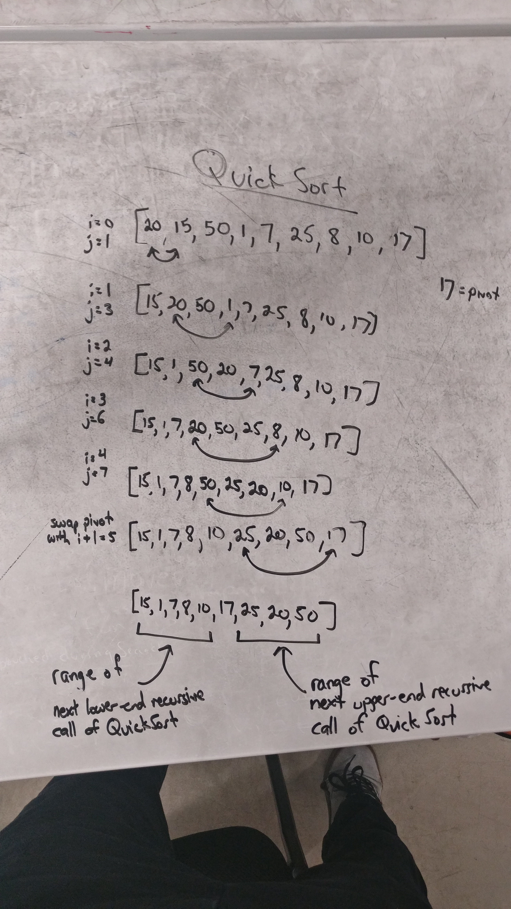

# Sorting Algorithms

## Insertion Sort

### Data Structure
This data structure is an array of integers.  
This array is originally unsorted (randomly set).  
Once the insertion sort is done then the array that is returned will be sorted (from smallest to largest).  

### Visual
  

### Implementation
I implemented this data structure using 2 loops.  
The first loop is a for loop to iterate through the array.  
The second loop is a while loop which only occurs when the current value is less than the previous value and the index is greater than 0.  
Inside this second loop is where a swap is done for the loop.  

### Examples
Sorting an array which is already mostly sorted.  
Another example would be when you are sorting cards in your hand.  
If you sort it from left to right, moving any that are smaller to the left, you are performing an insertion sort.  

## Merge Sort

### Description
This sorting method uses recursion to sort the given array.  
It first recursively divides the array until the size is 1.  
Then it starts merging them together while sorting them with the smallest value first.  
Temporary arrays holding the left and right values are created and filled.  
Then the merging is done through a while loop that compares two values and then puts the smallest value into the actual array.  
The loop breaks when one of the temp arrays reaches the end 
and then the rest of the array that didn't reach the end gets added onto the end of the actual array.  

### Visual
  

## Quick Sort

### Description
This sorting method uses recursion to sort the given array.  
It first takes a "pivot" and then compares the value at the pivot to the rest of the array.  
It has 2 counters; 1 for the where it is in the traversal, and one for the location of where it last swapped values.  
If the current value is less than the value at the pivot, 
the swap index increases by 1 and it swaps the values at the two counters mentioned above.  
Once the traversal is done, it swaps the value at the pivot with the value at the swap index + 1.  
It then recursively calls itself while decreasing the range of where it is swapping.  

### Visual

## Radix Sort

### Description
This sorting method uses recursion to sort a given array.  
It takes a look at each digit and then sorts the array based off of that from smallest to largest.  
Each iteration looks at a different digit ("ones", "tens", "hundreds", "thousands", etc...)  
The final iteration would then change the array to be correctly sorted.  

### Visual
I didn't have the time to draw a visual of it myself, but this video helped me understand radix sort.  
[Radix Sort Video](https://youtu.be/nu4gDuFabIM)  