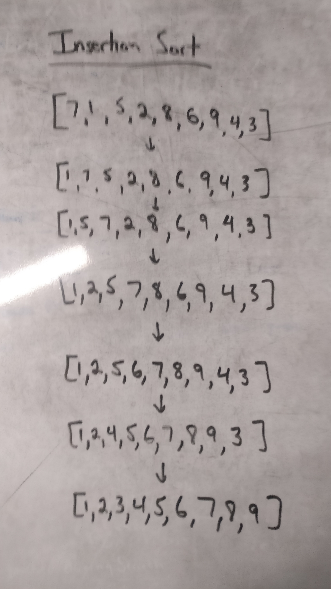

# Sorting Algorithms

## Insertion Sort

### Data Structure
This data structure is an array of integers.  
This array is originally unsorted (randomly set).  
Once the insertion sort is done then the array that is returned will be sorted (from smallest to largest).  

### Visual
  

### Implementation
I implemented this data structure using 2 loops.  
The first loop is a for loop to iterate through the array.  
The second loop is a while loop which only occurs when the current value is less than the previous value and the index is greater than 0.  
Inside this second loop is where a swap is done for the loop.  

### Examples
Sorting an array which is already mostly sorted.  
Another example would be when you are sorting cards in your hand.  
If you sort it from left to right, moving any that are smaller to the left, you are performing an insertion sort.  