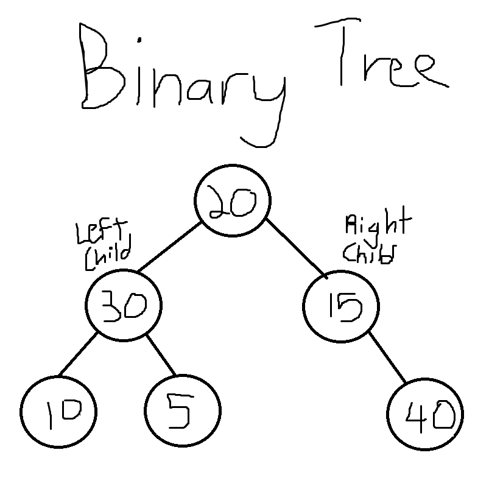
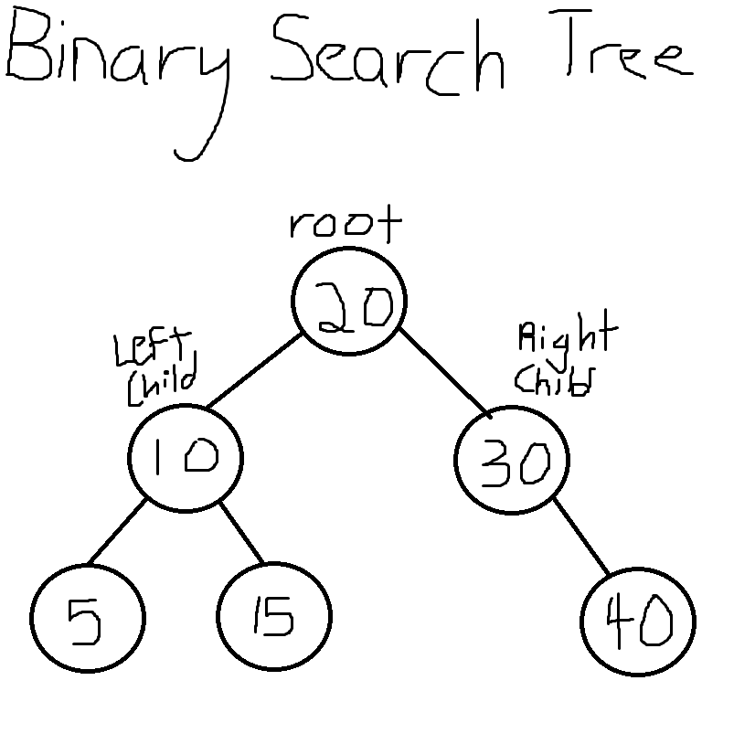

# Binary Tree and Binary Search Tree

## Data Structure
This data structure is a tree; it starts at a base/root node and then extends with branches to another node.  
There are 2 types of branches; a left branch and a right branch.  
Each node has 2 references; a LeftChild and a RightChild.  
The LeftChild corresponds to the node that the left branch connects to.  
The RightChild corresponds to the node that the right branch connects to.  
It is like a family tree with each person only having at most 2 children.

## Visual:
Here is how a binary tree might look like:  
  
  
Here is how a binary search tree might look like with the same nodes as above:  
  

## Implementation
I utilized nodes in order to implement binary trees and binary search trees.  
Other than the value, each node had 2 references to other nodes: a LeftChild and a RightChild.  
I implemented binary trees and binary search trees through classes and setting up methods for each.  
To implement this version of binary trees and binary search trees a few steps must be followed:  
1. Download Visual Studio  
2. Clone the GitHub repository "Data-Structures-And-Algorithms"  
3. Inside the folder "Trees" open the sln file "Trees" in Visual Studio  
4. You may now utilize the binary tree and binary search tree classes by using Trees.Classes as a library
and then using the Binary Tree and Binary Search Tree classes created in this solution.

## Example Uses
Binary Tree:  
A binary tree are used as a base for other tree structures.  

Binary Search Tree:
Like the name suggests, this is used in search applications. 
It is especially common where data is constantly added and deleted.  
It can also be used to implement a simple sorting algorithm.  

## Resources used:
[Wikipedia](https://en.wikipedia.org/wiki/Binary_search_tree)  
[Stack Overflow](https://stackoverflow.com/questions/2130416/what-are-the-applications-of-binary-trees)  